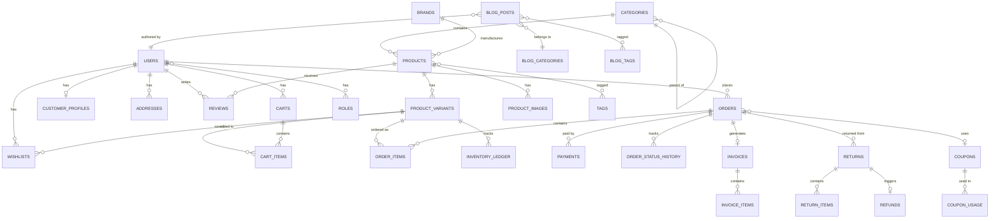
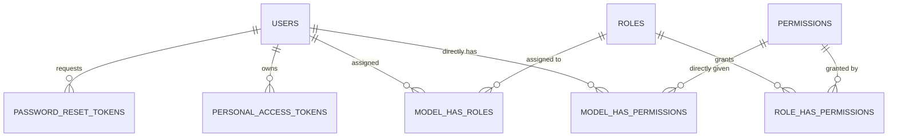
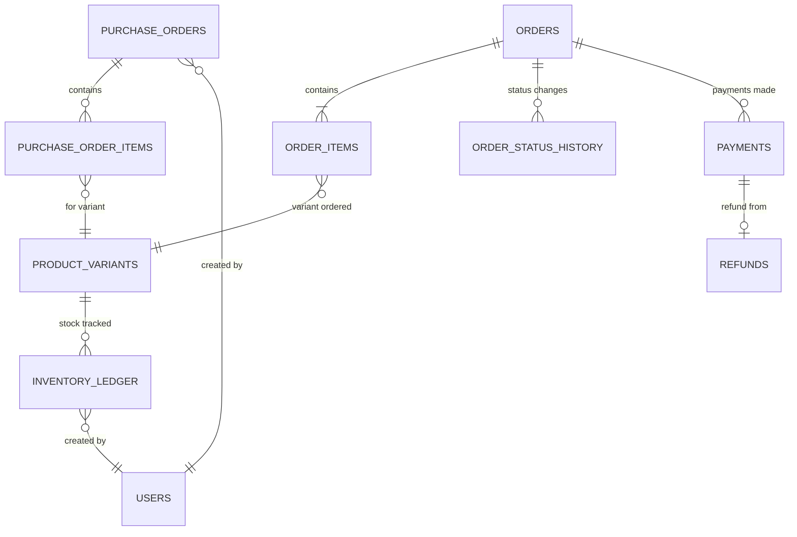

# Phase 3: Database Design Document

## Fashion E-Commerce Platform

**Document Version:** 1.0
**Date:** 2026-06-25
**Author:** Senior Database Architect
**Status:** Draft

---

## Table of Contents

1. [Design Principles](#1-design-principles)
2. [ER Diagram](#2-er-diagram)
3. [Table Structures](#3-table-structures)
4. [Index Strategy](#4-index-strategy)
5. [Inventory Ledger Design](#5-inventory-ledger-design)
6. [Audit Log Design](#6-audit-log-design)
7. [Data Integrity Rules](#7-data-integrity-rules)
8. [Migration Order](#8-migration-order)

---

## 1. Design Principles

| Principle | Implementation |
|-----------|----------------|
| **Normalization** | 3NF for transactional tables; denormalization only for read-heavy reports |
| **Referential Integrity** | Foreign keys with proper CASCADE/RESTRICT rules |
| **Soft Deletes** | `deleted_at` column on user-facing tables (products, customers, orders) |
| **Timestamps** | `created_at` + `updated_at` on all tables |
| **UUID Considerations** | BIGINT auto-increment PKs (performance); UUIDs for external-facing IDs |
| **Money** | `DECIMAL(12,2)` for all monetary values — never FLOAT |
| **Status Fields** | VARCHAR(30) for readability; indexed for queries |
| **JSON Columns** | For flexible metadata (product options, settings) |
| **Charset** | `utf8mb4` for full Unicode (emoji) support |

---

## 2. ER Diagram

### 2.1 Core Relationships (High-Level)



### 2.2 Auth & Permissions Relationships



### 2.3 Inventory & Order Flow



---

## 3. Table Structures

### 3.1 Authentication & Users

#### `users`

| Column | Type | Constraints | Description |
|--------|------|-------------|-------------|
| `id` | BIGINT UNSIGNED | PK, AUTO_INCREMENT | Primary key |
| `uuid` | CHAR(36) | UNIQUE, NOT NULL | Public-facing identifier |
| `first_name` | VARCHAR(100) | NOT NULL | First name |
| `last_name` | VARCHAR(100) | NOT NULL | Last name |
| `email` | VARCHAR(255) | UNIQUE, NOT NULL | Email address |
| `email_verified_at` | TIMESTAMP | NULLABLE | Email verification timestamp |
| `phone` | VARCHAR(20) | UNIQUE, NULLABLE | Phone number |
| `phone_verified_at` | TIMESTAMP | NULLABLE | Phone verification timestamp |
| `password` | VARCHAR(255) | NOT NULL | Bcrypt hashed password |
| `avatar` | VARCHAR(500) | NULLABLE | Profile image URL |
| `is_active` | BOOLEAN | DEFAULT TRUE | Account active status |
| `last_login_at` | TIMESTAMP | NULLABLE | Last login timestamp |
| `last_login_ip` | VARCHAR(45) | NULLABLE | Last login IP (IPv6 compatible) |
| `remember_token` | VARCHAR(100) | NULLABLE | Remember me token |
| `created_at` | TIMESTAMP | NOT NULL | Record creation time |
| `updated_at` | TIMESTAMP | NOT NULL | Last update time |
| `deleted_at` | TIMESTAMP | NULLABLE | Soft delete |

#### `roles`

| Column | Type | Constraints | Description |
|--------|------|-------------|-------------|
| `id` | BIGINT UNSIGNED | PK, AUTO_INCREMENT | Primary key |
| `name` | VARCHAR(50) | UNIQUE, NOT NULL | Role name (e.g., "super_admin") |
| `display_name` | VARCHAR(100) | NOT NULL | Human-readable name |
| `description` | VARCHAR(255) | NULLABLE | Role description |
| `guard_name` | VARCHAR(50) | NOT NULL, DEFAULT 'web' | Auth guard |
| `created_at` | TIMESTAMP | NOT NULL | |
| `updated_at` | TIMESTAMP | NOT NULL | |

#### `permissions`

| Column | Type | Constraints | Description |
|--------|------|-------------|-------------|
| `id` | BIGINT UNSIGNED | PK, AUTO_INCREMENT | Primary key |
| `name` | VARCHAR(100) | UNIQUE, NOT NULL | Permission slug (e.g., "products.create") |
| `display_name` | VARCHAR(150) | NOT NULL | Human-readable name |
| `group` | VARCHAR(50) | NOT NULL | Permission group (e.g., "products") |
| `guard_name` | VARCHAR(50) | NOT NULL, DEFAULT 'web' | Auth guard |
| `created_at` | TIMESTAMP | NOT NULL | |
| `updated_at` | TIMESTAMP | NOT NULL | |

#### `role_has_permissions`

| Column | Type | Constraints | Description |
|--------|------|-------------|-------------|
| `permission_id` | BIGINT UNSIGNED | FK → permissions.id, CASCADE | |
| `role_id` | BIGINT UNSIGNED | FK → roles.id, CASCADE | |
| **PK** | | `(permission_id, role_id)` | Composite primary key |

#### `model_has_roles`

| Column | Type | Constraints | Description |
|--------|------|-------------|-------------|
| `role_id` | BIGINT UNSIGNED | FK → roles.id, CASCADE | |
| `model_type` | VARCHAR(255) | NOT NULL | Polymorphic model type |
| `model_id` | BIGINT UNSIGNED | NOT NULL | Polymorphic model ID |
| **PK** | | `(role_id, model_id, model_type)` | Composite primary key |

#### `model_has_permissions`

| Column | Type | Constraints | Description |
|--------|------|-------------|-------------|
| `permission_id` | BIGINT UNSIGNED | FK → permissions.id, CASCADE | |
| `model_type` | VARCHAR(255) | NOT NULL | Polymorphic model type |
| `model_id` | BIGINT UNSIGNED | NOT NULL | Polymorphic model ID |
| **PK** | | `(permission_id, model_id, model_type)` | Composite primary key |

#### `password_reset_tokens`

| Column | Type | Constraints | Description |
|--------|------|-------------|-------------|
| `email` | VARCHAR(255) | PK | User email |
| `token` | VARCHAR(255) | NOT NULL | Reset token (hashed) |
| `created_at` | TIMESTAMP | NULLABLE | Token creation time |

#### `personal_access_tokens` (Sanctum)

| Column | Type | Constraints | Description |
|--------|------|-------------|-------------|
| `id` | BIGINT UNSIGNED | PK, AUTO_INCREMENT | |
| `tokenable_type` | VARCHAR(255) | NOT NULL | Polymorphic type |
| `tokenable_id` | BIGINT UNSIGNED | NOT NULL | Polymorphic ID |
| `name` | VARCHAR(255) | NOT NULL | Token name |
| `token` | VARCHAR(64) | UNIQUE, NOT NULL | Hashed token |
| `abilities` | TEXT | NULLABLE | Token abilities (JSON) |
| `last_used_at` | TIMESTAMP | NULLABLE | |
| `expires_at` | TIMESTAMP | NULLABLE | |
| `created_at` | TIMESTAMP | NOT NULL | |
| `updated_at` | TIMESTAMP | NOT NULL | |

---

### 3.2 Products

#### `categories`

| Column | Type | Constraints | Description |
|--------|------|-------------|-------------|
| `id` | BIGINT UNSIGNED | PK, AUTO_INCREMENT | |
| `parent_id` | BIGINT UNSIGNED | FK → categories.id, SET NULL, NULLABLE | Parent category |
| `name` | VARCHAR(150) | NOT NULL | Category name |
| `slug` | VARCHAR(180) | UNIQUE, NOT NULL | URL-friendly slug |
| `description` | TEXT | NULLABLE | Category description |
| `image` | VARCHAR(500) | NULLABLE | Category image URL |
| `icon` | VARCHAR(50) | NULLABLE | Icon class/name |
| `meta_title` | VARCHAR(200) | NULLABLE | SEO title |
| `meta_description` | VARCHAR(500) | NULLABLE | SEO description |
| `sort_order` | INT | DEFAULT 0 | Display order |
| `is_active` | BOOLEAN | DEFAULT TRUE | Visibility |
| `is_featured` | BOOLEAN | DEFAULT FALSE | Featured on homepage |
| `created_at` | TIMESTAMP | NOT NULL | |
| `updated_at` | TIMESTAMP | NOT NULL | |
| `deleted_at` | TIMESTAMP | NULLABLE | Soft delete |

#### `brands`

| Column | Type | Constraints | Description |
|--------|------|-------------|-------------|
| `id` | BIGINT UNSIGNED | PK, AUTO_INCREMENT | |
| `name` | VARCHAR(150) | NOT NULL | Brand name |
| `slug` | VARCHAR(180) | UNIQUE, NOT NULL | URL slug |
| `description` | TEXT | NULLABLE | Brand description |
| `logo` | VARCHAR(500) | NULLABLE | Brand logo URL |
| `website` | VARCHAR(500) | NULLABLE | Brand website |
| `meta_title` | VARCHAR(200) | NULLABLE | SEO title |
| `meta_description` | VARCHAR(500) | NULLABLE | SEO description |
| `sort_order` | INT | DEFAULT 0 | Display order |
| `is_active` | BOOLEAN | DEFAULT TRUE | Visibility |
| `created_at` | TIMESTAMP | NOT NULL | |
| `updated_at` | TIMESTAMP | NOT NULL | |
| `deleted_at` | TIMESTAMP | NULLABLE | |

#### `product_attributes`

| Column | Type | Constraints | Description |
|--------|------|-------------|-------------|
| `id` | BIGINT UNSIGNED | PK, AUTO_INCREMENT | |
| `name` | VARCHAR(100) | NOT NULL | Attribute name (e.g., "Size", "Color") |
| `slug` | VARCHAR(120) | UNIQUE, NOT NULL | URL slug |
| `type` | VARCHAR(30) | NOT NULL | "select", "color", "text" |
| `is_filterable` | BOOLEAN | DEFAULT TRUE | Show in filters |
| `is_visible` | BOOLEAN | DEFAULT TRUE | Show on product page |
| `sort_order` | INT | DEFAULT 0 | |
| `created_at` | TIMESTAMP | NOT NULL | |
| `updated_at` | TIMESTAMP | NOT NULL | |

#### `product_attribute_values`

| Column | Type | Constraints | Description |
|--------|------|-------------|-------------|
| `id` | BIGINT UNSIGNED | PK, AUTO_INCREMENT | |
| `attribute_id` | BIGINT UNSIGNED | FK → product_attributes.id, CASCADE | |
| `value` | VARCHAR(150) | NOT NULL | Value (e.g., "XL", "Red") |
| `color_code` | VARCHAR(7) | NULLABLE | Hex color for color attributes |
| `sort_order` | INT | DEFAULT 0 | |
| `created_at` | TIMESTAMP | NOT NULL | |
| `updated_at` | TIMESTAMP | NOT NULL | |

#### `tags`

| Column | Type | Constraints | Description |
|--------|------|-------------|-------------|
| `id` | BIGINT UNSIGNED | PK, AUTO_INCREMENT | |
| `name` | VARCHAR(100) | NOT NULL | Tag name |
| `slug` | VARCHAR(120) | UNIQUE, NOT NULL | URL slug |
| `created_at` | TIMESTAMP | NOT NULL | |
| `updated_at` | TIMESTAMP | NOT NULL | |

#### `products`

| Column | Type | Constraints | Description |
|--------|------|-------------|-------------|
| `id` | BIGINT UNSIGNED | PK, AUTO_INCREMENT | |
| `uuid` | CHAR(36) | UNIQUE, NOT NULL | Public identifier |
| `category_id` | BIGINT UNSIGNED | FK → categories.id, RESTRICT | Primary category |
| `brand_id` | BIGINT UNSIGNED | FK → brands.id, SET NULL, NULLABLE | Brand |
| `name` | VARCHAR(300) | NOT NULL | Product name |
| `slug` | VARCHAR(350) | UNIQUE, NOT NULL | URL slug |
| `short_description` | VARCHAR(500) | NULLABLE | Brief description |
| `description` | TEXT | NULLABLE | Full HTML description |
| `material` | VARCHAR(200) | NULLABLE | Material/fabric info |
| `care_instructions` | TEXT | NULLABLE | Washing/care info |
| `mrp` | DECIMAL(12,2) | NOT NULL | Maximum Retail Price |
| `selling_price` | DECIMAL(12,2) | NOT NULL | Current selling price |
| `cost_price` | DECIMAL(12,2) | NULLABLE | Cost price (admin only) |
| `tax_category` | VARCHAR(50) | NOT NULL, DEFAULT 'standard' | Tax category for GST |
| `gst_rate` | DECIMAL(5,2) | NOT NULL, DEFAULT 18.00 | GST percentage |
| `hsn_code` | VARCHAR(20) | NULLABLE | HSN/SAC code for GST |
| `weight` | DECIMAL(8,2) | NULLABLE | Weight in grams |
| `is_active` | BOOLEAN | DEFAULT TRUE | Published status |
| `is_featured` | BOOLEAN | DEFAULT FALSE | Featured product |
| `is_new_arrival` | BOOLEAN | DEFAULT FALSE | New arrival flag |
| `is_bestseller` | BOOLEAN | DEFAULT FALSE | Bestseller flag |
| `is_returnable` | BOOLEAN | DEFAULT TRUE | Can be returned |
| `return_window_days` | TINYINT UNSIGNED | DEFAULT 7 | Return window |
| `avg_rating` | DECIMAL(3,2) | DEFAULT 0.00 | Cached average rating |
| `total_reviews` | INT UNSIGNED | DEFAULT 0 | Cached review count |
| `total_sold` | INT UNSIGNED | DEFAULT 0 | Cached total sold |
| `meta_title` | VARCHAR(200) | NULLABLE | SEO title |
| `meta_description` | VARCHAR(500) | NULLABLE | SEO description |
| `meta_keywords` | VARCHAR(300) | NULLABLE | SEO keywords |
| `created_at` | TIMESTAMP | NOT NULL | |
| `updated_at` | TIMESTAMP | NOT NULL | |
| `deleted_at` | TIMESTAMP | NULLABLE | Soft delete |

#### `product_tag` (Pivot)

| Column | Type | Constraints | Description |
|--------|------|-------------|-------------|
| `product_id` | BIGINT UNSIGNED | FK → products.id, CASCADE | |
| `tag_id` | BIGINT UNSIGNED | FK → tags.id, CASCADE | |
| **PK** | | `(product_id, tag_id)` | Composite primary key |

#### `product_variants`

| Column | Type | Constraints | Description |
|--------|------|-------------|-------------|
| `id` | BIGINT UNSIGNED | PK, AUTO_INCREMENT | |
| `product_id` | BIGINT UNSIGNED | FK → products.id, CASCADE | Parent product |
| `sku` | VARCHAR(100) | UNIQUE, NOT NULL | Stock Keeping Unit |
| `size` | VARCHAR(30) | NULLABLE | Size (S, M, L, XL, etc.) |
| `color` | VARCHAR(50) | NULLABLE | Color name |
| `color_code` | VARCHAR(7) | NULLABLE | Hex color code |
| `mrp` | DECIMAL(12,2) | NULLABLE | Variant MRP (overrides product) |
| `selling_price` | DECIMAL(12,2) | NULLABLE | Variant price (overrides product) |
| `cost_price` | DECIMAL(12,2) | NULLABLE | Variant cost |
| `stock_quantity` | INT UNSIGNED | DEFAULT 0 | Current stock (denormalized) |
| `reserved_quantity` | INT UNSIGNED | DEFAULT 0 | Reserved stock (pending orders) |
| `low_stock_threshold` | INT UNSIGNED | DEFAULT 5 | Low stock alert level |
| `weight` | DECIMAL(8,2) | NULLABLE | Variant weight (overrides product) |
| `barcode` | VARCHAR(50) | NULLABLE | Barcode/EAN |
| `is_active` | BOOLEAN | DEFAULT TRUE | Variant availability |
| `sort_order` | INT | DEFAULT 0 | Display order |
| `created_at` | TIMESTAMP | NOT NULL | |
| `updated_at` | TIMESTAMP | NOT NULL | |
| `deleted_at` | TIMESTAMP | NULLABLE | |

#### `product_images`

| Column | Type | Constraints | Description |
|--------|------|-------------|-------------|
| `id` | BIGINT UNSIGNED | PK, AUTO_INCREMENT | |
| `product_id` | BIGINT UNSIGNED | FK → products.id, CASCADE | |
| `variant_id` | BIGINT UNSIGNED | FK → product_variants.id, SET NULL, NULLABLE | Variant-specific image |
| `url` | VARCHAR(500) | NOT NULL | Full image URL |
| `thumbnail_url` | VARCHAR(500) | NULLABLE | Thumbnail URL |
| `alt_text` | VARCHAR(200) | NULLABLE | Alt text for accessibility |
| `sort_order` | INT | DEFAULT 0 | Display order |
| `is_primary` | BOOLEAN | DEFAULT FALSE | Primary/hero image |
| `created_at` | TIMESTAMP | NOT NULL | |
| `updated_at` | TIMESTAMP | NOT NULL | |

---

### 3.3 Inventory

#### `inventory_ledger`

| Column | Type | Constraints | Description |
|--------|------|-------------|-------------|
| `id` | BIGINT UNSIGNED | PK, AUTO_INCREMENT | |
| `product_variant_id` | BIGINT UNSIGNED | FK → product_variants.id, RESTRICT | Which variant |
| `type` | VARCHAR(30) | NOT NULL | PURCHASE, SALE, RETURN, DAMAGE, ADJUSTMENT, TRANSFER, RESERVATION, RELEASE |
| `direction` | VARCHAR(3) | NOT NULL | "IN" or "OUT" |
| `quantity` | INT UNSIGNED | NOT NULL | Number of units |
| `unit_cost` | DECIMAL(12,2) | NULLABLE | Cost per unit at time of entry |
| `reference_type` | VARCHAR(100) | NULLABLE | Polymorphic: Order, PurchaseOrder, etc. |
| `reference_id` | BIGINT UNSIGNED | NULLABLE | Polymorphic ID |
| `stock_before` | INT UNSIGNED | NOT NULL | Stock level before this entry |
| `stock_after` | INT UNSIGNED | NOT NULL | Stock level after this entry |
| `notes` | VARCHAR(500) | NULLABLE | Additional context |
| `created_by` | BIGINT UNSIGNED | FK → users.id, SET NULL, NULLABLE | Who created |
| `created_at` | TIMESTAMP | NOT NULL | |

#### `purchase_orders`

| Column | Type | Constraints | Description |
|--------|------|-------------|-------------|
| `id` | BIGINT UNSIGNED | PK, AUTO_INCREMENT | |
| `po_number` | VARCHAR(50) | UNIQUE, NOT NULL | e.g., "PO-2026-00001" |
| `supplier_name` | VARCHAR(200) | NOT NULL | Supplier |
| `supplier_contact` | VARCHAR(200) | NULLABLE | Supplier contact info |
| `status` | VARCHAR(30) | DEFAULT 'draft' | draft, ordered, received, partial, cancelled |
| `total_amount` | DECIMAL(12,2) | DEFAULT 0.00 | Total PO value |
| `notes` | TEXT | NULLABLE | |
| `ordered_at` | TIMESTAMP | NULLABLE | Date ordered |
| `received_at` | TIMESTAMP | NULLABLE | Date received |
| `created_by` | BIGINT UNSIGNED | FK → users.id, SET NULL | |
| `created_at` | TIMESTAMP | NOT NULL | |
| `updated_at` | TIMESTAMP | NOT NULL | |

#### `purchase_order_items`

| Column | Type | Constraints | Description |
|--------|------|-------------|-------------|
| `id` | BIGINT UNSIGNED | PK, AUTO_INCREMENT | |
| `purchase_order_id` | BIGINT UNSIGNED | FK → purchase_orders.id, CASCADE | |
| `product_variant_id` | BIGINT UNSIGNED | FK → product_variants.id, RESTRICT | |
| `quantity_ordered` | INT UNSIGNED | NOT NULL | Quantity ordered |
| `quantity_received` | INT UNSIGNED | DEFAULT 0 | Quantity received |
| `unit_cost` | DECIMAL(12,2) | NOT NULL | Cost per unit |
| `total_cost` | DECIMAL(12,2) | NOT NULL | Line total |
| `created_at` | TIMESTAMP | NOT NULL | |
| `updated_at` | TIMESTAMP | NOT NULL | |

---

### 3.4 Customers

#### `customer_profiles`

| Column | Type | Constraints | Description |
|--------|------|-------------|-------------|
| `id` | BIGINT UNSIGNED | PK, AUTO_INCREMENT | |
| `user_id` | BIGINT UNSIGNED | FK → users.id, CASCADE, UNIQUE | One-to-one with user |
| `date_of_birth` | DATE | NULLABLE | Birthday |
| `gender` | VARCHAR(20) | NULLABLE | Male, Female, Other, Prefer not to say |
| `total_orders` | INT UNSIGNED | DEFAULT 0 | Cached order count |
| `total_spent` | DECIMAL(12,2) | DEFAULT 0.00 | Cached total spend |
| `last_order_at` | TIMESTAMP | NULLABLE | Last order date |
| `notes` | TEXT | NULLABLE | Admin notes |
| `email_subscribed` | BOOLEAN | DEFAULT FALSE | Newsletter subscription |
| `sms_subscribed` | BOOLEAN | DEFAULT FALSE | SMS marketing |
| `created_at` | TIMESTAMP | NOT NULL | |
| `updated_at` | TIMESTAMP | NOT NULL | |

#### `addresses`

| Column | Type | Constraints | Description |
|--------|------|-------------|-------------|
| `id` | BIGINT UNSIGNED | PK, AUTO_INCREMENT | |
| `user_id` | BIGINT UNSIGNED | FK → users.id, CASCADE | |
| `label` | VARCHAR(50) | NULLABLE | "Home", "Office", etc. |
| `first_name` | VARCHAR(100) | NOT NULL | Recipient first name |
| `last_name` | VARCHAR(100) | NOT NULL | Recipient last name |
| `phone` | VARCHAR(20) | NOT NULL | Contact phone |
| `address_line_1` | VARCHAR(255) | NOT NULL | Street address |
| `address_line_2` | VARCHAR(255) | NULLABLE | Apartment, suite, etc. |
| `city` | VARCHAR(100) | NOT NULL | City |
| `state` | VARCHAR(100) | NOT NULL | State/Province |
| `postal_code` | VARCHAR(20) | NOT NULL | PIN/ZIP code |
| `country` | VARCHAR(2) | NOT NULL, DEFAULT 'IN' | ISO country code |
| `landmark` | VARCHAR(200) | NULLABLE | Nearby landmark |
| `is_default_shipping` | BOOLEAN | DEFAULT FALSE | Default shipping address |
| `is_default_billing` | BOOLEAN | DEFAULT FALSE | Default billing address |
| `created_at` | TIMESTAMP | NOT NULL | |
| `updated_at` | TIMESTAMP | NOT NULL | |
| `deleted_at` | TIMESTAMP | NULLABLE | Soft delete |

---

### 3.5 Cart

#### `carts`

| Column | Type | Constraints | Description |
|--------|------|-------------|-------------|
| `id` | BIGINT UNSIGNED | PK, AUTO_INCREMENT | |
| `user_id` | BIGINT UNSIGNED | FK → users.id, CASCADE, NULLABLE | NULL for guest carts |
| `session_id` | VARCHAR(100) | NULLABLE | Guest cart identifier |
| `coupon_id` | BIGINT UNSIGNED | FK → coupons.id, SET NULL, NULLABLE | Applied coupon |
| `subtotal` | DECIMAL(12,2) | DEFAULT 0.00 | Items total |
| `discount` | DECIMAL(12,2) | DEFAULT 0.00 | Coupon discount |
| `tax` | DECIMAL(12,2) | DEFAULT 0.00 | Tax amount |
| `total` | DECIMAL(12,2) | DEFAULT 0.00 | Grand total |
| `item_count` | INT UNSIGNED | DEFAULT 0 | Total items |
| `expires_at` | TIMESTAMP | NULLABLE | Auto-cleanup for guest carts |
| `created_at` | TIMESTAMP | NOT NULL | |
| `updated_at` | TIMESTAMP | NOT NULL | |

#### `cart_items`

| Column | Type | Constraints | Description |
|--------|------|-------------|-------------|
| `id` | BIGINT UNSIGNED | PK, AUTO_INCREMENT | |
| `cart_id` | BIGINT UNSIGNED | FK → carts.id, CASCADE | |
| `product_id` | BIGINT UNSIGNED | FK → products.id, RESTRICT | |
| `product_variant_id` | BIGINT UNSIGNED | FK → product_variants.id, RESTRICT | |
| `quantity` | INT UNSIGNED | NOT NULL, DEFAULT 1 | |
| `unit_price` | DECIMAL(12,2) | NOT NULL | Price at time of adding |
| `total_price` | DECIMAL(12,2) | NOT NULL | quantity × unit_price |
| `created_at` | TIMESTAMP | NOT NULL | |
| `updated_at` | TIMESTAMP | NOT NULL | |

---

### 3.6 Orders

#### `orders`

| Column | Type | Constraints | Description |
|--------|------|-------------|-------------|
| `id` | BIGINT UNSIGNED | PK, AUTO_INCREMENT | |
| `uuid` | CHAR(36) | UNIQUE, NOT NULL | Public identifier |
| `order_number` | VARCHAR(30) | UNIQUE, NOT NULL | e.g., "ORD-20260625-00001" |
| `user_id` | BIGINT UNSIGNED | FK → users.id, RESTRICT | Customer |
| `coupon_id` | BIGINT UNSIGNED | FK → coupons.id, SET NULL, NULLABLE | Applied coupon |
| `status` | VARCHAR(30) | NOT NULL, DEFAULT 'pending' | Order status |
| `payment_status` | VARCHAR(30) | NOT NULL, DEFAULT 'pending' | paid, pending, failed, refunded, partial_refund |
| `payment_method` | VARCHAR(30) | NULLABLE | upi, credit_card, debit_card, net_banking, cod, wallet |
| `subtotal` | DECIMAL(12,2) | NOT NULL | Items subtotal |
| `discount_amount` | DECIMAL(12,2) | DEFAULT 0.00 | Coupon discount |
| `tax_amount` | DECIMAL(12,2) | DEFAULT 0.00 | Total tax |
| `cgst_amount` | DECIMAL(12,2) | DEFAULT 0.00 | Central GST |
| `sgst_amount` | DECIMAL(12,2) | DEFAULT 0.00 | State GST |
| `igst_amount` | DECIMAL(12,2) | DEFAULT 0.00 | Integrated GST |
| `shipping_amount` | DECIMAL(12,2) | DEFAULT 0.00 | Shipping charges |
| `grand_total` | DECIMAL(12,2) | NOT NULL | Final amount |
| `total_items` | INT UNSIGNED | NOT NULL | Item count |
| `currency` | VARCHAR(3) | NOT NULL, DEFAULT 'INR' | Currency code |
| `shipping_first_name` | VARCHAR(100) | NOT NULL | Shipping name |
| `shipping_last_name` | VARCHAR(100) | NOT NULL | |
| `shipping_phone` | VARCHAR(20) | NOT NULL | |
| `shipping_address_line_1` | VARCHAR(255) | NOT NULL | Denormalized for immutability |
| `shipping_address_line_2` | VARCHAR(255) | NULLABLE | |
| `shipping_city` | VARCHAR(100) | NOT NULL | |
| `shipping_state` | VARCHAR(100) | NOT NULL | |
| `shipping_postal_code` | VARCHAR(20) | NOT NULL | |
| `shipping_country` | VARCHAR(2) | NOT NULL | |
| `billing_first_name` | VARCHAR(100) | NOT NULL | |
| `billing_last_name` | VARCHAR(100) | NOT NULL | |
| `billing_phone` | VARCHAR(20) | NOT NULL | |
| `billing_address_line_1` | VARCHAR(255) | NOT NULL | |
| `billing_address_line_2` | VARCHAR(255) | NULLABLE | |
| `billing_city` | VARCHAR(100) | NOT NULL | |
| `billing_state` | VARCHAR(100) | NOT NULL | |
| `billing_postal_code` | VARCHAR(20) | NOT NULL | |
| `billing_country` | VARCHAR(2) | NOT NULL | |
| `shipping_method` | VARCHAR(50) | NULLABLE | standard, express |
| `tracking_number` | VARCHAR(100) | NULLABLE | Courier tracking |
| `courier_name` | VARCHAR(100) | NULLABLE | Courier company |
| `estimated_delivery_at` | TIMESTAMP | NULLABLE | Expected delivery |
| `shipped_at` | TIMESTAMP | NULLABLE | Ship date |
| `delivered_at` | TIMESTAMP | NULLABLE | Delivery date |
| `cancelled_at` | TIMESTAMP | NULLABLE | Cancellation date |
| `cancellation_reason` | VARCHAR(500) | NULLABLE | |
| `notes` | TEXT | NULLABLE | Customer/admin notes |
| `admin_notes` | TEXT | NULLABLE | Internal notes |
| `ip_address` | VARCHAR(45) | NULLABLE | Customer IP |
| `user_agent` | VARCHAR(500) | NULLABLE | Customer browser |
| `created_at` | TIMESTAMP | NOT NULL | |
| `updated_at` | TIMESTAMP | NOT NULL | |
| `deleted_at` | TIMESTAMP | NULLABLE | Soft delete |

#### `order_items`

| Column | Type | Constraints | Description |
|--------|------|-------------|-------------|
| `id` | BIGINT UNSIGNED | PK, AUTO_INCREMENT | |
| `order_id` | BIGINT UNSIGNED | FK → orders.id, CASCADE | |
| `product_id` | BIGINT UNSIGNED | FK → products.id, RESTRICT | |
| `product_variant_id` | BIGINT UNSIGNED | FK → product_variants.id, RESTRICT | |
| `product_name` | VARCHAR(300) | NOT NULL | Snapshot at order time |
| `variant_name` | VARCHAR(100) | NULLABLE | e.g., "L / Red" |
| `sku` | VARCHAR(100) | NOT NULL | SKU at order time |
| `quantity` | INT UNSIGNED | NOT NULL | |
| `unit_price` | DECIMAL(12,2) | NOT NULL | Price per unit |
| `unit_mrp` | DECIMAL(12,2) | NOT NULL | MRP per unit |
| `discount` | DECIMAL(12,2) | DEFAULT 0.00 | Per-item discount |
| `tax_amount` | DECIMAL(12,2) | DEFAULT 0.00 | Tax for this line |
| `tax_rate` | DECIMAL(5,2) | NOT NULL | GST rate applied |
| `total_price` | DECIMAL(12,2) | NOT NULL | Line total |
| `status` | VARCHAR(30) | NOT NULL, DEFAULT 'active' | active, cancelled, returned |
| `created_at` | TIMESTAMP | NOT NULL | |
| `updated_at` | TIMESTAMP | NOT NULL | |

#### `order_status_history`

| Column | Type | Constraints | Description |
|--------|------|-------------|-------------|
| `id` | BIGINT UNSIGNED | PK, AUTO_INCREMENT | |
| `order_id` | BIGINT UNSIGNED | FK → orders.id, CASCADE | |
| `from_status` | VARCHAR(30) | NULLABLE | Previous status |
| `to_status` | VARCHAR(30) | NOT NULL | New status |
| `comment` | VARCHAR(500) | NULLABLE | Status change notes |
| `changed_by` | BIGINT UNSIGNED | FK → users.id, SET NULL, NULLABLE | Who changed |
| `created_at` | TIMESTAMP | NOT NULL | |

---

### 3.7 Payments & Refunds

#### `payments`

| Column | Type | Constraints | Description |
|--------|------|-------------|-------------|
| `id` | BIGINT UNSIGNED | PK, AUTO_INCREMENT | |
| `uuid` | CHAR(36) | UNIQUE, NOT NULL | |
| `order_id` | BIGINT UNSIGNED | FK → orders.id, RESTRICT | |
| `gateway` | VARCHAR(30) | NOT NULL | razorpay, stripe, cod |
| `gateway_payment_id` | VARCHAR(255) | NULLABLE | Gateway's payment ID |
| `gateway_order_id` | VARCHAR(255) | NULLABLE | Gateway's order ID |
| `gateway_signature` | VARCHAR(500) | NULLABLE | Payment signature |
| `method` | VARCHAR(30) | NOT NULL | upi, credit_card, debit_card, net_banking, cod, wallet |
| `amount` | DECIMAL(12,2) | NOT NULL | Payment amount |
| `currency` | VARCHAR(3) | NOT NULL, DEFAULT 'INR' | |
| `status` | VARCHAR(30) | NOT NULL, DEFAULT 'pending' | pending, authorized, captured, failed, refunded |
| `failure_reason` | VARCHAR(500) | NULLABLE | |
| `paid_at` | TIMESTAMP | NULLABLE | |
| `gateway_response` | JSON | NULLABLE | Full gateway response |
| `created_at` | TIMESTAMP | NOT NULL | |
| `updated_at` | TIMESTAMP | NOT NULL | |

#### `refunds`

| Column | Type | Constraints | Description |
|--------|------|-------------|-------------|
| `id` | BIGINT UNSIGNED | PK, AUTO_INCREMENT | |
| `uuid` | CHAR(36) | UNIQUE, NOT NULL | |
| `payment_id` | BIGINT UNSIGNED | FK → payments.id, RESTRICT | Original payment |
| `order_id` | BIGINT UNSIGNED | FK → orders.id, RESTRICT | |
| `return_id` | BIGINT UNSIGNED | FK → returns.id, SET NULL, NULLABLE | Associated return |
| `gateway_refund_id` | VARCHAR(255) | NULLABLE | Gateway's refund ID |
| `amount` | DECIMAL(12,2) | NOT NULL | Refund amount |
| `reason` | VARCHAR(500) | NOT NULL | Refund reason |
| `status` | VARCHAR(30) | NOT NULL, DEFAULT 'pending' | pending, processed, failed |
| `processed_at` | TIMESTAMP | NULLABLE | |
| `gateway_response` | JSON | NULLABLE | |
| `created_by` | BIGINT UNSIGNED | FK → users.id, SET NULL | Admin who initiated |
| `created_at` | TIMESTAMP | NOT NULL | |
| `updated_at` | TIMESTAMP | NOT NULL | |

---

### 3.8 Returns

#### `returns`

| Column | Type | Constraints | Description |
|--------|------|-------------|-------------|
| `id` | BIGINT UNSIGNED | PK, AUTO_INCREMENT | |
| `uuid` | CHAR(36) | UNIQUE, NOT NULL | |
| `return_number` | VARCHAR(30) | UNIQUE, NOT NULL | e.g., "RET-20260625-00001" |
| `order_id` | BIGINT UNSIGNED | FK → orders.id, RESTRICT | |
| `user_id` | BIGINT UNSIGNED | FK → users.id, RESTRICT | |
| `status` | VARCHAR(30) | NOT NULL, DEFAULT 'requested' | requested, approved, rejected, pickup_scheduled, picked_up, qc_passed, qc_failed, refunded |
| `reason` | VARCHAR(30) | NOT NULL | wrong_size, defective, not_as_described, wrong_item, other |
| `description` | TEXT | NULLABLE | Customer's description |
| `admin_notes` | TEXT | NULLABLE | Admin notes |
| `refund_amount` | DECIMAL(12,2) | NULLABLE | Approved refund amount |
| `pickup_scheduled_at` | TIMESTAMP | NULLABLE | |
| `picked_up_at` | TIMESTAMP | NULLABLE | |
| `qc_completed_at` | TIMESTAMP | NULLABLE | |
| `approved_at` | TIMESTAMP | NULLABLE | |
| `rejected_at` | TIMESTAMP | NULLABLE | |
| `rejection_reason` | VARCHAR(500) | NULLABLE | |
| `created_at` | TIMESTAMP | NOT NULL | |
| `updated_at` | TIMESTAMP | NOT NULL | |

#### `return_items`

| Column | Type | Constraints | Description |
|--------|------|-------------|-------------|
| `id` | BIGINT UNSIGNED | PK, AUTO_INCREMENT | |
| `return_id` | BIGINT UNSIGNED | FK → returns.id, CASCADE | |
| `order_item_id` | BIGINT UNSIGNED | FK → order_items.id, RESTRICT | |
| `product_variant_id` | BIGINT UNSIGNED | FK → product_variants.id, RESTRICT | |
| `quantity` | INT UNSIGNED | NOT NULL | Quantity being returned |
| `reason` | VARCHAR(30) | NOT NULL | Item-level reason |
| `photos` | JSON | NULLABLE | Array of photo URLs |
| `qc_status` | VARCHAR(30) | NULLABLE | passed, failed |
| `qc_notes` | VARCHAR(500) | NULLABLE | |
| `created_at` | TIMESTAMP | NOT NULL | |
| `updated_at` | TIMESTAMP | NOT NULL | |

---

### 3.9 Coupons

#### `coupons`

| Column | Type | Constraints | Description |
|--------|------|-------------|-------------|
| `id` | BIGINT UNSIGNED | PK, AUTO_INCREMENT | |
| `code` | VARCHAR(50) | UNIQUE, NOT NULL | Coupon code (uppercase) |
| `name` | VARCHAR(200) | NOT NULL | Internal name |
| `description` | VARCHAR(500) | NULLABLE | Customer-facing description |
| `type` | VARCHAR(30) | NOT NULL | percentage, flat, free_shipping, buy_x_get_y |
| `value` | DECIMAL(12,2) | NOT NULL | Discount value (% or flat amount) |
| `max_discount` | DECIMAL(12,2) | NULLABLE | Cap on discount amount |
| `min_order_value` | DECIMAL(12,2) | NULLABLE | Minimum cart value |
| `max_uses_total` | INT UNSIGNED | NULLABLE | Total usage limit |
| `max_uses_per_user` | INT UNSIGNED | DEFAULT 1 | Per-customer limit |
| `times_used` | INT UNSIGNED | DEFAULT 0 | Current usage count |
| `applicable_category_ids` | JSON | NULLABLE | Specific categories |
| `applicable_brand_ids` | JSON | NULLABLE | Specific brands |
| `applicable_product_ids` | JSON | NULLABLE | Specific products |
| `excluded_product_ids` | JSON | NULLABLE | Excluded products |
| `first_order_only` | BOOLEAN | DEFAULT FALSE | New customer only |
| `is_auto_apply` | BOOLEAN | DEFAULT FALSE | Auto-apply when eligible |
| `is_combinable` | BOOLEAN | DEFAULT FALSE | Can stack with others |
| `is_active` | BOOLEAN | DEFAULT TRUE | |
| `starts_at` | TIMESTAMP | NOT NULL | Valid from |
| `expires_at` | TIMESTAMP | NULLABLE | Valid until |
| `created_by` | BIGINT UNSIGNED | FK → users.id, SET NULL | |
| `created_at` | TIMESTAMP | NOT NULL | |
| `updated_at` | TIMESTAMP | NOT NULL | |
| `deleted_at` | TIMESTAMP | NULLABLE | |

#### `coupon_usage`

| Column | Type | Constraints | Description |
|--------|------|-------------|-------------|
| `id` | BIGINT UNSIGNED | PK, AUTO_INCREMENT | |
| `coupon_id` | BIGINT UNSIGNED | FK → coupons.id, CASCADE | |
| `user_id` | BIGINT UNSIGNED | FK → users.id, CASCADE | |
| `order_id` | BIGINT UNSIGNED | FK → orders.id, CASCADE | |
| `discount_amount` | DECIMAL(12,2) | NOT NULL | Actual discount applied |
| `created_at` | TIMESTAMP | NOT NULL | |

---

### 3.10 Billing

#### `invoices`

| Column | Type | Constraints | Description |
|--------|------|-------------|-------------|
| `id` | BIGINT UNSIGNED | PK, AUTO_INCREMENT | |
| `invoice_number` | VARCHAR(30) | UNIQUE, NOT NULL | e.g., "INV-2026-000001" |
| `order_id` | BIGINT UNSIGNED | FK → orders.id, RESTRICT | |
| `user_id` | BIGINT UNSIGNED | FK → users.id, RESTRICT | |
| `type` | VARCHAR(20) | NOT NULL, DEFAULT 'tax' | proforma, tax |
| `subtotal` | DECIMAL(12,2) | NOT NULL | |
| `discount_amount` | DECIMAL(12,2) | DEFAULT 0.00 | |
| `tax_amount` | DECIMAL(12,2) | DEFAULT 0.00 | |
| `cgst_amount` | DECIMAL(12,2) | DEFAULT 0.00 | |
| `sgst_amount` | DECIMAL(12,2) | DEFAULT 0.00 | |
| `igst_amount` | DECIMAL(12,2) | DEFAULT 0.00 | |
| `shipping_amount` | DECIMAL(12,2) | DEFAULT 0.00 | |
| `grand_total` | DECIMAL(12,2) | NOT NULL | |
| `currency` | VARCHAR(3) | NOT NULL, DEFAULT 'INR' | |
| `billing_name` | VARCHAR(200) | NOT NULL | |
| `billing_address` | TEXT | NOT NULL | Full billing address |
| `billing_gstin` | VARCHAR(20) | NULLABLE | Customer GSTIN |
| `seller_gstin` | VARCHAR(20) | NOT NULL | Seller GSTIN |
| `seller_state` | VARCHAR(100) | NOT NULL | For GST type determination |
| `pdf_url` | VARCHAR(500) | NULLABLE | Generated PDF URL |
| `generated_at` | TIMESTAMP | NOT NULL | |
| `created_at` | TIMESTAMP | NOT NULL | |
| `updated_at` | TIMESTAMP | NOT NULL | |

#### `invoice_items`

| Column | Type | Constraints | Description |
|--------|------|-------------|-------------|
| `id` | BIGINT UNSIGNED | PK, AUTO_INCREMENT | |
| `invoice_id` | BIGINT UNSIGNED | FK → invoices.id, CASCADE | |
| `description` | VARCHAR(500) | NOT NULL | Item description |
| `hsn_code` | VARCHAR(20) | NULLABLE | |
| `quantity` | INT UNSIGNED | NOT NULL | |
| `unit_price` | DECIMAL(12,2) | NOT NULL | |
| `discount` | DECIMAL(12,2) | DEFAULT 0.00 | |
| `tax_rate` | DECIMAL(5,2) | NOT NULL | |
| `tax_amount` | DECIMAL(12,2) | NOT NULL | |
| `total` | DECIMAL(12,2) | NOT NULL | |
| `created_at` | TIMESTAMP | NOT NULL | |
| `updated_at` | TIMESTAMP | NOT NULL | |

#### `credit_notes`

| Column | Type | Constraints | Description |
|--------|------|-------------|-------------|
| `id` | BIGINT UNSIGNED | PK, AUTO_INCREMENT | |
| `credit_note_number` | VARCHAR(30) | UNIQUE, NOT NULL | e.g., "CN-2026-000001" |
| `invoice_id` | BIGINT UNSIGNED | FK → invoices.id, RESTRICT | Original invoice |
| `order_id` | BIGINT UNSIGNED | FK → orders.id, RESTRICT | |
| `return_id` | BIGINT UNSIGNED | FK → returns.id, SET NULL, NULLABLE | |
| `amount` | DECIMAL(12,2) | NOT NULL | Credit amount |
| `tax_amount` | DECIMAL(12,2) | DEFAULT 0.00 | |
| `reason` | VARCHAR(500) | NOT NULL | |
| `pdf_url` | VARCHAR(500) | NULLABLE | |
| `generated_at` | TIMESTAMP | NOT NULL | |
| `created_at` | TIMESTAMP | NOT NULL | |
| `updated_at` | TIMESTAMP | NOT NULL | |

---

### 3.11 Reviews

#### `reviews`

| Column | Type | Constraints | Description |
|--------|------|-------------|-------------|
| `id` | BIGINT UNSIGNED | PK, AUTO_INCREMENT | |
| `product_id` | BIGINT UNSIGNED | FK → products.id, CASCADE | |
| `user_id` | BIGINT UNSIGNED | FK → users.id, CASCADE | |
| `order_item_id` | BIGINT UNSIGNED | FK → order_items.id, SET NULL, NULLABLE | Verified purchase |
| `rating` | TINYINT UNSIGNED | NOT NULL, CHECK (1-5) | Star rating |
| `title` | VARCHAR(200) | NULLABLE | Review title |
| `body` | TEXT | NULLABLE | Review text |
| `photos` | JSON | NULLABLE | Array of photo URLs |
| `is_verified_purchase` | BOOLEAN | DEFAULT FALSE | Bought this product |
| `is_approved` | BOOLEAN | DEFAULT FALSE | Moderation status |
| `is_featured` | BOOLEAN | DEFAULT FALSE | |
| `helpful_count` | INT UNSIGNED | DEFAULT 0 | "Was this helpful?" count |
| `admin_reply` | TEXT | NULLABLE | Admin response |
| `created_at` | TIMESTAMP | NOT NULL | |
| `updated_at` | TIMESTAMP | NOT NULL | |
| `deleted_at` | TIMESTAMP | NULLABLE | |

---

### 3.12 Blog

#### `blog_categories`

| Column | Type | Constraints | Description |
|--------|------|-------------|-------------|
| `id` | BIGINT UNSIGNED | PK, AUTO_INCREMENT | |
| `name` | VARCHAR(150) | NOT NULL | |
| `slug` | VARCHAR(180) | UNIQUE, NOT NULL | |
| `description` | TEXT | NULLABLE | |
| `sort_order` | INT | DEFAULT 0 | |
| `is_active` | BOOLEAN | DEFAULT TRUE | |
| `created_at` | TIMESTAMP | NOT NULL | |
| `updated_at` | TIMESTAMP | NOT NULL | |

#### `blog_tags`

| Column | Type | Constraints | Description |
|--------|------|-------------|-------------|
| `id` | BIGINT UNSIGNED | PK, AUTO_INCREMENT | |
| `name` | VARCHAR(100) | NOT NULL | |
| `slug` | VARCHAR(120) | UNIQUE, NOT NULL | |
| `created_at` | TIMESTAMP | NOT NULL | |
| `updated_at` | TIMESTAMP | NOT NULL | |

#### `blog_posts`

| Column | Type | Constraints | Description |
|--------|------|-------------|-------------|
| `id` | BIGINT UNSIGNED | PK, AUTO_INCREMENT | |
| `blog_category_id` | BIGINT UNSIGNED | FK → blog_categories.id, SET NULL, NULLABLE | |
| `author_id` | BIGINT UNSIGNED | FK → users.id, SET NULL | |
| `title` | VARCHAR(300) | NOT NULL | |
| `slug` | VARCHAR(350) | UNIQUE, NOT NULL | |
| `excerpt` | VARCHAR(500) | NULLABLE | Short summary |
| `content` | LONGTEXT | NOT NULL | Full HTML content |
| `featured_image` | VARCHAR(500) | NULLABLE | |
| `status` | VARCHAR(20) | NOT NULL, DEFAULT 'draft' | draft, published, archived |
| `is_featured` | BOOLEAN | DEFAULT FALSE | |
| `views_count` | INT UNSIGNED | DEFAULT 0 | |
| `meta_title` | VARCHAR(200) | NULLABLE | |
| `meta_description` | VARCHAR(500) | NULLABLE | |
| `published_at` | TIMESTAMP | NULLABLE | |
| `created_at` | TIMESTAMP | NOT NULL | |
| `updated_at` | TIMESTAMP | NOT NULL | |
| `deleted_at` | TIMESTAMP | NULLABLE | |

#### `blog_post_tag` (Pivot)

| Column | Type | Constraints | Description |
|--------|------|-------------|-------------|
| `blog_post_id` | BIGINT UNSIGNED | FK → blog_posts.id, CASCADE | |
| `blog_tag_id` | BIGINT UNSIGNED | FK → blog_tags.id, CASCADE | |
| **PK** | | `(blog_post_id, blog_tag_id)` | Composite primary key |

---

### 3.13 Wishlist

#### `wishlists`

| Column | Type | Constraints | Description |
|--------|------|-------------|-------------|
| `id` | BIGINT UNSIGNED | PK, AUTO_INCREMENT | |
| `user_id` | BIGINT UNSIGNED | FK → users.id, CASCADE | |
| `product_id` | BIGINT UNSIGNED | FK → products.id, CASCADE | |
| `product_variant_id` | BIGINT UNSIGNED | FK → product_variants.id, SET NULL, NULLABLE | Optional specific variant |
| `created_at` | TIMESTAMP | NOT NULL | |
| **UNIQUE** | | `(user_id, product_id)` | One wishlist entry per product per user |

---

### 3.14 Settings

#### `settings`

| Column | Type | Constraints | Description |
|--------|------|-------------|-------------|
| `id` | BIGINT UNSIGNED | PK, AUTO_INCREMENT | |
| `group` | VARCHAR(50) | NOT NULL | general, tax, shipping, payment, email, sms, seo |
| `key` | VARCHAR(100) | NOT NULL | Setting key |
| `value` | TEXT | NULLABLE | Setting value |
| `type` | VARCHAR(20) | NOT NULL, DEFAULT 'text' | text, number, boolean, json, email |
| `description` | VARCHAR(300) | NULLABLE | Human-readable description |
| `created_at` | TIMESTAMP | NOT NULL | |
| `updated_at` | TIMESTAMP | NOT NULL | |
| **UNIQUE** | | `(group, key)` | Unique setting per group |

---

### 3.15 Audit Logs

#### `audit_logs`

| Column | Type | Constraints | Description |
|--------|------|-------------|-------------|
| `id` | BIGINT UNSIGNED | PK, AUTO_INCREMENT | |
| `user_id` | BIGINT UNSIGNED | FK → users.id, SET NULL, NULLABLE | Who performed action |
| `auditable_type` | VARCHAR(255) | NOT NULL | Model class (polymorphic) |
| `auditable_id` | BIGINT UNSIGNED | NOT NULL | Model ID (polymorphic) |
| `event` | VARCHAR(30) | NOT NULL | created, updated, deleted, restored |
| `old_values` | JSON | NULLABLE | Before state |
| `new_values` | JSON | NULLABLE | After state |
| `ip_address` | VARCHAR(45) | NULLABLE | |
| `user_agent` | VARCHAR(500) | NULLABLE | |
| `url` | VARCHAR(500) | NULLABLE | Request URL |
| `created_at` | TIMESTAMP | NOT NULL | |

---

## 4. Index Strategy

### 4.1 Primary & Unique Indexes (Auto-created)

All `id` columns have clustered primary indexes. All `UNIQUE` constraints create unique indexes automatically.

### 4.2 Foreign Key Indexes (Auto-created)

All foreign key columns automatically get indexes in MySQL InnoDB.

### 4.3 Custom Performance Indexes

#### Users

| Index Name | Columns | Type | Purpose |
|------------|---------|------|---------|
| `idx_users_email` | `email` | UNIQUE | Login lookup |
| `idx_users_phone` | `phone` | UNIQUE | Phone lookup |
| `idx_users_uuid` | `uuid` | UNIQUE | API lookup |
| `idx_users_active` | `is_active, deleted_at` | COMPOSITE | Active user queries |

#### Products

| Index Name | Columns | Type | Purpose |
|------------|---------|------|---------|
| `idx_products_slug` | `slug` | UNIQUE | URL lookup |
| `idx_products_category` | `category_id, is_active` | COMPOSITE | Category listing |
| `idx_products_brand` | `brand_id, is_active` | COMPOSITE | Brand listing |
| `idx_products_active` | `is_active, deleted_at` | COMPOSITE | Active product queries |
| `idx_products_featured` | `is_featured, is_active` | COMPOSITE | Featured products |
| `idx_products_new` | `is_new_arrival, is_active, created_at` | COMPOSITE | New arrivals |
| `idx_products_bestseller` | `is_bestseller, is_active` | COMPOSITE | Bestsellers |
| `idx_products_price` | `selling_price` | INDEX | Price sorting/filtering |
| `idx_products_search` | `name, short_description` | FULLTEXT | Basic text search fallback |

#### Product Variants

| Index Name | Columns | Type | Purpose |
|------------|---------|------|---------|
| `idx_variants_sku` | `sku` | UNIQUE | SKU lookup |
| `idx_variants_product_active` | `product_id, is_active` | COMPOSITE | Variant listing |
| `idx_variants_stock` | `product_id, stock_quantity` | COMPOSITE | Stock queries |
| `idx_variants_barcode` | `barcode` | INDEX | Barcode scanning |

#### Orders

| Index Name | Columns | Type | Purpose |
|------------|---------|------|---------|
| `idx_orders_number` | `order_number` | UNIQUE | Order lookup |
| `idx_orders_uuid` | `uuid` | UNIQUE | API lookup |
| `idx_orders_user` | `user_id, created_at` | COMPOSITE | Customer order history |
| `idx_orders_status` | `status, created_at` | COMPOSITE | Status-based queries |
| `idx_orders_payment_status` | `payment_status` | INDEX | Payment status filter |
| `idx_orders_date` | `created_at` | INDEX | Date range reports |
| `idx_orders_tracking` | `tracking_number` | INDEX | Track by tracking number |

#### Inventory Ledger

| Index Name | Columns | Type | Purpose |
|------------|---------|------|---------|
| `idx_ledger_variant` | `product_variant_id, created_at` | COMPOSITE | Stock history |
| `idx_ledger_type` | `type, created_at` | COMPOSITE | Movement type queries |
| `idx_ledger_reference` | `reference_type, reference_id` | COMPOSITE | Reference lookup |

#### Payments

| Index Name | Columns | Type | Purpose |
|------------|---------|------|---------|
| `idx_payments_order` | `order_id` | INDEX | Order payments |
| `idx_payments_gateway_id` | `gateway_payment_id` | INDEX | Gateway reconciliation |
| `idx_payments_status` | `status, created_at` | COMPOSITE | Payment status reports |

#### Coupons

| Index Name | Columns | Type | Purpose |
|------------|---------|------|---------|
| `idx_coupons_code` | `code` | UNIQUE | Code lookup |
| `idx_coupons_active` | `is_active, starts_at, expires_at` | COMPOSITE | Valid coupon queries |

#### Blog Posts

| Index Name | Columns | Type | Purpose |
|------------|---------|------|---------|
| `idx_blog_slug` | `slug` | UNIQUE | URL lookup |
| `idx_blog_status` | `status, published_at` | COMPOSITE | Published posts |
| `idx_blog_category` | `blog_category_id, status` | COMPOSITE | Category listing |
| `idx_blog_search` | `title, content` | FULLTEXT | Blog search |

#### Audit Logs

| Index Name | Columns | Type | Purpose |
|------------|---------|------|---------|
| `idx_audit_auditable` | `auditable_type, auditable_id` | COMPOSITE | Model history |
| `idx_audit_user` | `user_id, created_at` | COMPOSITE | User activity |
| `idx_audit_event` | `event, created_at` | COMPOSITE | Event type queries |

#### Reviews

| Index Name | Columns | Type | Purpose |
|------------|---------|------|---------|
| `idx_reviews_product` | `product_id, is_approved, created_at` | COMPOSITE | Product reviews |
| `idx_reviews_user` | `user_id` | INDEX | User's reviews |
| `idx_reviews_rating` | `product_id, rating` | COMPOSITE | Rating distribution |

---

## 5. Inventory Ledger Design

### 5.1 Double-Entry Ledger Principle

Every stock movement is recorded as an immutable ledger entry. The current stock is calculated from the sum of all entries but also denormalized on `product_variants.stock_quantity` for performance.

### 5.2 Movement Types

| Type | Direction | Trigger | Description |
|------|-----------|---------|-------------|
| `PURCHASE` | IN | Purchase order received | New stock from supplier |
| `SALE` | OUT | Order confirmed | Stock sold to customer |
| `RETURN` | IN | Return QC passed | Returned stock back to shelf |
| `DAMAGE` | OUT | Admin records damage | Damaged/unsellable stock |
| `ADJUSTMENT_IN` | IN | Stock count correction | Positive adjustment |
| `ADJUSTMENT_OUT` | OUT | Stock count correction | Negative adjustment |
| `RESERVATION` | OUT | Order placed (pending) | Soft hold on stock |
| `RELEASE` | IN | Payment timeout/cancel | Release reserved stock |
| `TRANSFER_IN` | IN | Warehouse transfer | Stock received from transfer |
| `TRANSFER_OUT` | OUT | Warehouse transfer | Stock sent in transfer |

### 5.3 Stock Calculation

```
Available Stock = stock_quantity - reserved_quantity

Where:
  stock_quantity   = SUM(ledger entries WHERE direction = IN) - SUM(WHERE direction = OUT)
                     [excluding RESERVATION/RELEASE entries]
  reserved_quantity = SUM(active reservations not yet deducted)
```

### 5.4 Concurrency Control

```
Stock deduction uses database-level locking:

BEGIN TRANSACTION;

SELECT stock_quantity, reserved_quantity
FROM product_variants
WHERE id = ?
FOR UPDATE;  -- Row-level lock

-- Validate stock available
-- Deduct stock
-- Insert ledger entry

UPDATE product_variants
SET stock_quantity = stock_quantity - ?,
    updated_at = NOW()
WHERE id = ?;

COMMIT;
```

---

## 6. Audit Log Design

### 6.1 Polymorphic Audit Trail

The `audit_logs` table uses Laravel's polymorphic pattern to track changes across all models.

### 6.2 Audited Models

| Model | Events Tracked | Fields Tracked |
|-------|---------------|----------------|
| Product | create, update, delete | All except timestamps |
| ProductVariant | create, update, delete | price, stock, status |
| Order | create, update | status, payment_status, tracking |
| Payment | create, update | status, amount |
| Refund | create, update | status, amount |
| Coupon | create, update, delete | All |
| User | create, update | role changes, status |
| Setting | update | value changes |
| InventoryLedger | create | All (immutable records) |

### 6.3 Audit Log Query Patterns

| Query | Purpose | Index Used |
|-------|---------|------------|
| `WHERE auditable_type = 'Product' AND auditable_id = 123` | Product change history | `idx_audit_auditable` |
| `WHERE user_id = 5 ORDER BY created_at DESC` | User activity log | `idx_audit_user` |
| `WHERE event = 'deleted' AND created_at > ?` | Recent deletions | `idx_audit_event` |

---

## 7. Data Integrity Rules

### 7.1 Foreign Key Actions

| Relationship | ON DELETE | ON UPDATE | Rationale |
|-------------|-----------|-----------|-----------|
| orders → users | RESTRICT | CASCADE | Cannot delete user with orders |
| order_items → orders | CASCADE | CASCADE | Delete items with order |
| order_items → products | RESTRICT | CASCADE | Cannot delete product with orders |
| cart_items → carts | CASCADE | CASCADE | Delete items with cart |
| cart_items → product_variants | RESTRICT | CASCADE | Cannot delete variant in cart |
| product_variants → products | CASCADE | CASCADE | Delete variants with product |
| product_images → products | CASCADE | CASCADE | Delete images with product |
| inventory_ledger → product_variants | RESTRICT | CASCADE | Cannot delete variant with ledger |
| payments → orders | RESTRICT | CASCADE | Cannot delete order with payments |
| reviews → products | CASCADE | CASCADE | Delete reviews with product |
| addresses → users | CASCADE | CASCADE | Delete addresses with user |
| wishlists → users | CASCADE | CASCADE | |
| wishlists → products | CASCADE | CASCADE | |
| coupon_usage → coupons | CASCADE | CASCADE | |
| audit_logs → users | SET NULL | CASCADE | Keep audit even if user deleted |

### 7.2 Check Constraints

```sql
-- Product pricing
ALTER TABLE products ADD CONSTRAINT chk_products_price 
  CHECK (selling_price > 0 AND mrp >= selling_price);

-- Order amounts
ALTER TABLE orders ADD CONSTRAINT chk_orders_total 
  CHECK (grand_total >= 0);

-- Review rating
ALTER TABLE reviews ADD CONSTRAINT chk_reviews_rating 
  CHECK (rating >= 1 AND rating <= 5);

-- Stock quantity
ALTER TABLE product_variants ADD CONSTRAINT chk_variants_stock 
  CHECK (stock_quantity >= 0 AND reserved_quantity >= 0);

-- Coupon value
ALTER TABLE coupons ADD CONSTRAINT chk_coupons_value 
  CHECK (value > 0);
```

### 7.3 Application-Level Rules (Not Enforced by DB)

| Rule | Enforced In |
|------|-------------|
| Order status transitions (valid state machine) | OrderService |
| Coupon eligibility (dates, usage limits, min order) | CouponService |
| Inventory reservation timeout (30 min) | Scheduled command |
| One review per product per user | ReviewService + unique constraint |
| Maximum 5 addresses per user | AddressService |

---

## 8. Migration Order

Migrations must be created in dependency order:

```
001_create_users_table
002_create_password_reset_tokens_table
003_create_personal_access_tokens_table
004_create_roles_table
005_create_permissions_table
006_create_role_has_permissions_table
007_create_model_has_roles_table
008_create_model_has_permissions_table
009_create_categories_table
010_create_brands_table
011_create_product_attributes_table
012_create_product_attribute_values_table
013_create_tags_table
014_create_products_table
015_create_product_tag_table
016_create_product_variants_table
017_create_product_images_table
018_create_customer_profiles_table
019_create_addresses_table
020_create_coupons_table
021_create_carts_table
022_create_cart_items_table
023_create_orders_table
024_create_order_items_table
025_create_order_status_history_table
026_create_payments_table
027_create_returns_table
028_create_return_items_table
029_create_refunds_table
030_create_invoices_table
031_create_invoice_items_table
032_create_credit_notes_table
033_create_inventory_ledger_table
034_create_purchase_orders_table
035_create_purchase_order_items_table
036_create_reviews_table
037_create_wishlists_table
038_create_blog_categories_table
039_create_blog_tags_table
040_create_blog_posts_table
041_create_blog_post_tag_table
042_create_coupon_usage_table
043_create_settings_table
044_create_audit_logs_table
045_create_notifications_table
```

**Total Tables: ~45**

---

### Table Count Summary

| Module | Tables | Count |
|--------|--------|-------|
| Auth & Users | users, password_reset_tokens, personal_access_tokens, roles, permissions, role_has_permissions, model_has_roles, model_has_permissions | 8 |
| Products | categories, brands, product_attributes, product_attribute_values, tags, products, product_tag, product_variants, product_images | 9 |
| Inventory | inventory_ledger, purchase_orders, purchase_order_items | 3 |
| Customers | customer_profiles, addresses | 2 |
| Cart | carts, cart_items | 2 |
| Orders | orders, order_items, order_status_history | 3 |
| Payments | payments, refunds | 2 |
| Returns | returns, return_items | 2 |
| Coupons | coupons, coupon_usage | 2 |
| Billing | invoices, invoice_items, credit_notes | 3 |
| Reviews | reviews | 1 |
| Blog | blog_categories, blog_tags, blog_posts, blog_post_tag | 4 |
| Wishlist | wishlists | 1 |
| Settings | settings | 1 |
| Audit | audit_logs | 1 |
| Notifications | notifications (Laravel default) | 1 |
| **Total** | | **45** |

---

*End of Database Design Document — Phase 3*
